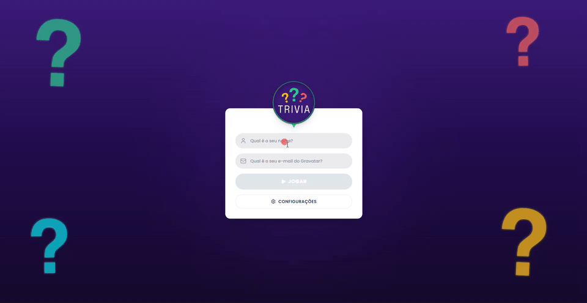
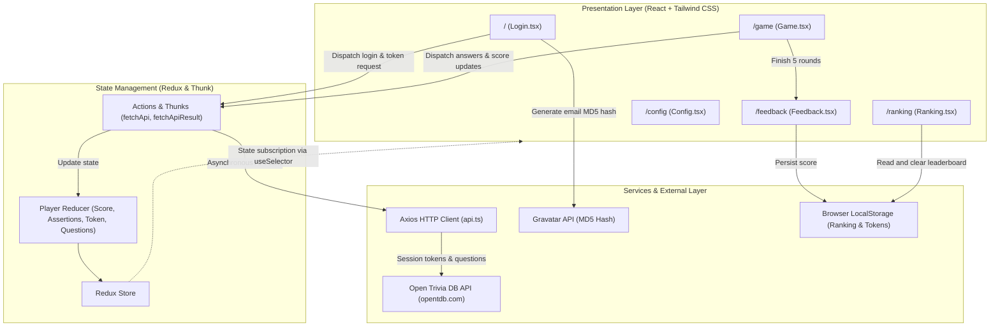

# Trivia Game 🎲

[](https://reactjs.org/)
[](https://www.typescriptlang.org/)
[](https://redux.js.org/)
[](https://tailwindcss.com/)
[](https://vitejs.dev/)
[](https://axios-http.com/)
[](https://vitest.dev/)
[](https://opensource.org/licenses/MIT)

> 🇧🇷 [**Versão em Português**](README.md) | 🇺🇸 **English**

A dynamic and interactive trivia quiz game featuring real-time leaderboard ranking, built with **React**, **TypeScript**, **Redux**, and **Tailwind CSS**, powered by the Open Trivia Database (OpenTDB) API with session token authentication, timed scoring, and Gravatar profile integration.

## 📌 Quick Navigation

- [📝 About the Project](#-about-the-project)
- [🖼️ Preview](#️-preview)
- [🌐 Live Application](#-live-application)
- [⚡ API Endpoints](#-api-endpoints)
- [✨ Key Features](#-key-features)
- [🛠️ Technologies and Tools Used](#️-technologies-and-tools-used)
- [🏛️ Solution Architecture](#️-solution-architecture)
- [📁 Repository Structure](#-repository-structure)
- [💡 Technical Decisions](#-technical-decisions)
- [🚀 Getting Started](#-getting-started)
- [📄 License](#-license)

## 📝 About the Project

**Trivia Game** is a comprehensive web application designed to deliver an immersive and responsive player experience. Built upon high-fidelity Figma design specifications, it features a dynamic dark purple theme (`#3C1B7A`), smooth vector floating animations, reactive state transitions, and a scoring formula that factors in remaining time and question difficulty.

The application leverages a modern developer ecosystem featuring Vite for instant start and Hot Module Replacement (HMR), strict type safety with TypeScript, predictable global state management via Redux Thunk, and an end-to-end automated test suite built with Vitest and React Testing Library.

## 🖼️ Preview



## 🌐 Live Application

Access the application in production:
👉 **[Trivia Game](https://trivia-nine-mu.vercel.app/)**

## ⚡ API Endpoints

The application consumes public REST services from the **[Open Trivia Database (OpenTDB)](https://opentdb.com/)** using a centralized Axios client configured with timeouts:

| Method | Endpoint | Description |
| :--- | :--- | :--- |
| `GET` | `https://opentdb.com/api_token.php?command=request` | Generates a unique session token to prevent repeated questions |
| `GET` | `https://opentdb.com/api.php?amount=5&token={token}` | Fetches 5 trivia questions with shuffled options |
| `GET` | `https://opentdb.com/api.php?amount=5&token={token}&category={id}&difficulty={diff}&type={type}` | Fetches questions applying custom game settings filters |
| `GET` | `https://opentdb.com/api_category.php` | Lists all available trivia categories for the configuration screen |
| `GET` | `https://www.gravatar.com/avatar/{hash}` | Loads player avatar via encrypted MD5 email hash |

## ✨ Key Features

- **Authentication & Validation Lobby**:
  - Reactive field validation (minimum 4 characters for player name and valid email format).
  - Automated session token retrieval from OpenTDB for fresh question sets.
  - Dynamic avatar generation using Crypto-JS MD5 hash linked to Gravatar.
- **Gameplay Engine**:
  - 30-second countdown timer per question.
  - Lettered pill options (A, B, C, D) with stable randomized answer order.
  - Instant visual feedback on selection (emerald glow for correct, coral glow for incorrect).
  - Option locking and answer revelation upon timer expiration.
  - Dynamic score formula: `Score = 10 + (Remaining Seconds × Difficulty Multiplier)` (Easy: 1x, Medium: 2x, Hard: 3x).
  - Next question button with fixed-height container and `pop-in` animation, completely preventing layout shifts.
  - Category pill with dynamic color matching (Politics in yellow, Entertainment in cyan, Science in green, History in red, etc.).
- **Feedback Screen**:
  - Summary of correct answers (*assertions*) and total score achieved.
  - Adaptive encouraging messages based on performance (*"MANDOU BEM!"* for ≥ 3 assertions, *"PODIA SER MELHOR..."* for lower scores).
- **Leaderboard (Ranking)**:
  - Match history persisted in browser `LocalStorage`.
  - Automatic descending sort by player score.
  - Podium badges for top 3 positions and history clearance support.
- **Settings Panel**:
  - Dynamic category selection loaded live from OpenTDB API.
  - Difficulty filters (Any, Easy, Medium, Hard).
  - Question types (Multiple Choice or True/False).

## 🛠️ Technologies and Tools Used

| Layer / Purpose | Technology | Description |
| :--- | :--- | :--- |
| **Core Language** | **TypeScript 4.9** | Strict static typing for state, action creators, and API contracts |
| **UI Library** | **React 17** | Declarative component architecture using modern functional hooks |
| **State Management** | **Redux 4.2 & Redux Thunk** | Unidirectional, predictable global data flow with async thunk handling |
| **Styling & Design** | **Tailwind CSS 3.4 & PostCSS** | Atomic design tokens, custom glow effects, and responsive utilities |
| **Bundler & Dev Server** | **Vite 8.3** | Blazing-fast build pipeline, sub-second HMR, and optimized bundles |
| **Routing** | **React Router DOM 5.3** | Client-side SPA navigation with synchronized history management |
| **HTTP Client** | **Axios 1.2** | Structured REST client with timeout configuration and error handling |
| **Automated Testing** | **Vitest 5.0 & Testing Library** | Unit and integration test suite executing within JSDOM environment |
| **Cryptography** | **Crypto-JS 4.1 & Gravatar** | MD5 hash computation for global player profile picture loading |
| **Vector Icons** | **Lucide React** | Modern, clean, and consistent vector iconography |
| **Code Quality** | **ESLint & TypeScript-ESLint** | Static code analysis enforcing clean code practices and standards |

## 🏛️ Solution Architecture



## 📁 Repository Structure

```text
project-trivia-react-redux/
├── public/                  # Static assets and PWA metadata
│   ├── favicon.svg          # Custom trivia question mark favicon
│   └── manifest.json        # Web application manifest
├── src/
│   ├── assets/              # High-fidelity design vector assets
│   │   └── trivia-logo.svg  # Official game SVG logo
│   ├── Components/          # Reusable UI components
│   │   ├── AnswerButtons.tsx # Dynamic category pill, question card, and options
│   │   ├── Feedback.tsx     # Game summary and score statistics
│   │   ├── Header.tsx       # Player profile, Gravatar avatar, and score
│   │   ├── TriviaBackground.tsx # Vector animated background with floating question marks
│   │   └── TriviaLogo.tsx   # SVG game logo renderer
│   ├── Pages/               # Route views
│   │   ├── Config.tsx       # Advanced category, difficulty, and type filters
│   │   ├── Game.tsx         # Round engine, countdown timer, and transitions
│   │   ├── Login.tsx        # Player setup, Gravatar preview, and validations
│   │   └── Ranking.tsx      # Persistent leaderboard with podium badges
│   ├── redux/               # Redux state architecture
│   │   ├── actions/         # Typed action creators and Axios thunks
│   │   ├── reducers/        # State reducers
│   │   └── store/           # Redux store configuration
│   ├── services/            # Integration services
│   │   └── api.ts           # Configured Axios client for OpenTDB
│   ├── tests/               # Automated test suite using Vitest
│   │   ├── helpers/         # Custom renderWithRouterAndRedux
│   │   ├── Feedback.test.tsx
│   │   ├── Game.test.tsx
│   │   ├── Login.test.tsx
│   │   └── Ranking.test.tsx
│   ├── types/               # TypeScript interfaces and contracts
│   │   └── index.ts         # Data models and state definitions
│   ├── utils/               # Pure helper utilities
│   │   ├── decodeHtml.ts    # HTML entity decoder
│   │   └── gravatar.ts      # MD5 email hash generator
│   ├── App.css              # Tailwind directives and custom keyframe animations
│   ├── App.tsx              # Application routing table
│   ├── index.tsx            # React root mount with Redux Provider
│   ├── react-app-env.d.ts   # Global static module declarations
│   └── setupTests.ts        # Vitest global configurations and mocks
├── index.html               # Vite HTML entry point with Google Fonts
├── tailwind.config.js       # Tailwind theme, color palette, and shadows
├── tsconfig.json            # TypeScript compiler configuration
├── vite.config.mts          # Vite build pipeline and dev server configuration
└── vitest.config.mts        # Vitest test runner configuration
```

## 💡 Technical Decisions

1. **Migration to Vite (`vite.config.mts`)**:
   - Replaced legacy tooling with a cutting-edge bundler delivering sub-second cold starts and instantaneous Hot Module Replacement.
2. **Comprehensive TypeScript Coverage**:
   - Complete type definitions for external API responses, Redux action payloads, and component props, ensuring compile-time safety and predictable refactoring.
3. **Tailwind CSS with Custom Design Tokens**:
   - Semantic tokens (`trivia-purple`, `trivia-green`, `trivia-red`, etc.) and tailored glow shadows reproducing the Figma design without heavy third-party UI dependencies.
4. **Zero Layout Shift UI Design**:
   - Constant button border widths (`border-2`) and fixed transition containers (`h-14`), eliminating visual jumps when answers are clicked.
5. **Dynamic Semantic Category Theming**:
   - Intelligent category matching attributing custom pill colors (Politics, Entertainment, Science, etc.), enriching visual variety between questions.
6. **Modern Testing with Vitest**:
   - Leveraged Vite's native transformation pipeline to execute fast, reliable unit and integration tests fully compatible with `@testing-library`.

## 🚀 Getting Started

### Prerequisites
- [Node.js](https://nodejs.org/) version 16 or higher installed.
- Package manager (`npm` or `yarn`).

### Step-by-Step Installation

1. **Clone the repository:**
```bash
git clone https://github.com/ludson96/project-trivia-react-redux.git
cd project-trivia-react-redux
```

2. **Install dependencies:**
```bash
npm install
```

3. **Start the local development server:**
```bash
npm run dev
# or
npm start
```
Open `http://localhost:3000` in your web browser.

4. **Run the automated test suite:**
```bash
npm test
```

5. **Run the code linter:**
```bash
npm run lint
```

6. **Generate a production build:**
```bash
npm run build
```

## 📄 License

This project is licensed under the **MIT License**. See the [LICENSE](LICENSE) file for details.

<div align="center">
  Developed by <strong>Ludson Pereira dos Santos</strong> 🚀<br />
  <a href="https://www.linkedin.com/in/ludson96/">LinkedIn</a> • <a href="https://github.com/ludson96">GitHub</a> • <a href="mailto:ludson_ps27@hotmail.com">Email</a>
</div>
