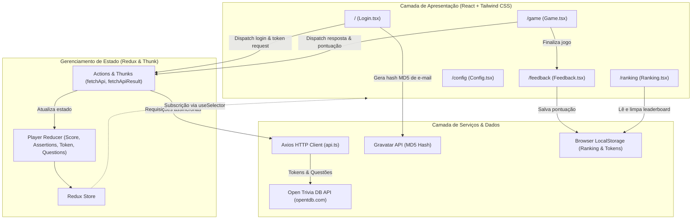

# Trivia Game 🎲

[](https://reactjs.org/)
[](https://www.typescriptlang.org/)
[](https://redux.js.org/)
[](https://tailwindcss.com/)
[](https://vitejs.dev/)
[](https://axios-http.com/)
[](https://vitest.dev/)
[](https://opensource.org/licenses/MIT)

> 🇧🇷 **Português** | 🇺🇸 [**English Version**](README.en.md)

Um jogo dinâmico e interativo de perguntas e respostas com ranking em tempo real, desenvolvido em **React**, **TypeScript**, **Redux** e **Tailwind CSS**, alimentado pela API do Open Trivia Database (OpenTDB) com autenticação por token de sessão, pontuação baseada em tempo e integração com avatares do Gravatar.

## 📌 Navegação Rápida

- [📝 Sobre o Projeto](#-sobre-o-projeto)
- [🖼️ Preview](#️-preview)
- [🌐 Deploy da Aplicação](#-deploy-da-aplicação)
- [⚡ API Endpoints](#-api-endpoints)
- [✨ Funcionalidades](#-funcionalidades)
- [🛠️ Tecnologias e Ferramentas Utilizadas](#️-tecnologias-e-ferramentas-utilizadas)
- [🏛️ Arquitetura da Solução](#️-arquitetura-da-solução)
- [📁 Estrutura do Repositório](#-estrutura-do-repositório)
- [💡 Decisões Técnicas](#-decisões-técnicas)
- [🚀 Como Executar o Projeto](#-como-executar-o-projeto)
- [📄 Licença](#-licença)

## 📝 Sobre o Projeto

O **Trivia Game** é uma aplicação web completa projetada para oferecer uma experiência imersiva e responsiva aos jogadores. Seguindo especificações de design do Figma em alta fidelidade, o jogo apresenta um tema escuro dinâmico (`#3C1B7A`), animações de flutuação suave, transições de estado reativas e um algoritmo de pontuação que pondera o tempo restante com a dificuldade da questão.

A aplicação conta com um ecossistema moderno de desenvolvimento com Vite para inicialização instantânea (HMR), tipagem estrita com TypeScript, gerenciamento de estado previsível via Redux Thunk e uma suíte de testes unitários e de integração com Vitest e Testing Library.

## 🖼️ Preview


## 🌐 Deploy da Aplicação

Acesse a aplicação em produção:
👉 **[Trivia Game](https://trivia-nine-mu.vercel.app/)**

## ⚡ API Endpoints

A aplicação consome os serviços REST públicos da **[Open Trivia Database (OpenTDB)](https://opentdb.com/)** através de um cliente Axios padronizado e com controle de timeout:

| Método | Endpoint | Finalidade |
| :--- | :--- | :--- |
| `GET` | `https://opentdb.com/api_token.php?command=request` | Gera um token de sessão exclusivo para evitar repetição de questões |
| `GET` | `https://opentdb.com/api.php?amount=5&token={token}` | Retorna 5 perguntas com alternativas corretas e incorretas embaralhadas |
| `GET` | `https://opentdb.com/api.php?amount=5&token={token}&category={id}&difficulty={diff}&type={type}` | Busca perguntas aplicando filtros customizados (configurações) |
| `GET` | `https://opentdb.com/api_category.php` | Lista todas as categorias disponíveis para a tela de configurações |
| `GET` | `https://www.gravatar.com/avatar/{hash}` | Renderiza o avatar do jogador via hash MD5 criptografado do e-mail |

## ✨ Funcionalidades

- **Lobby de Autenticação & Validação**:
  - Validação reativa de campos (nome mínimo de 4 caracteres e e-mail no formato correto).
  - Obtenção automática de token de sessão único na OpenTDB para a rodada.
  - Avatar dinâmico obtido do Gravatar gerado com hash MD5 via Crypto-JS.
- **Motor de Gameplay**:
  - Cronômetro regressivo de 30 segundos por questão.
  - Alternativas com letras de identificação (A, B, C, D) e ordem aleatória estável.
  - Revelação visual imediata após resposta (verde com glow para acerto e vermelho com glow para erro).
  - Bloqueio de alternativas e revelação das cores quando o tempo se esgota.
  - Cálculo de pontuação dinâmico: `Pontos = 10 + (Tempo Restante × Multiplicador de Dificuldade)` (Easy: 1x, Medium: 2x, Hard: 3x).
  - Transição de botão de próxima pergunta com container fixo e animação `pop-in`, prevenindo deslocamentos de layout.
  - Pílula de categoria com paleta de cores temática exclusiva por assunto (Política em amarelo, Entretenimento em ciano, Ciências em verde, História em vermelho, etc.).
- **Tela de Feedback**:
  - Resumo de acertos (*assertions*) e pontuação total alcançada.
  - Mensagens adaptativas de incentivo dependendo da performance do usuário (*"MANDOU BEM!"* para ≥ 3 acertos, *"PODIA SER MELHOR..."* para pontuações menores).
- **Leaderboard (Ranking)**:
  - Registro histórico de partidas salvo no `LocalStorage`.
  - Ordenação decrescente automática por pontuação.
  - Medalhas de pódio para os três primeiros colocados e botão de limpar histórico.
- **Painel de Configurações**:
  - Seleção dinâmica de categorias carregadas diretamente da API.
  - Filtros de dificuldade (Todas, Fácil, Média, Difícil).
  - Formatos de questão (Múltipla Escolha ou Verdadeiro/Falso).

## 🛠️ Tecnologias e Ferramentas Utilizadas

| Camada / Finalidade | Tecnologia | Descrição |
| :--- | :--- | :--- |
| **Linguagem Principal** | **TypeScript 4.9** | Tipagem estática rigorosa para estado global, actions e contratos de API |
| **Biblioteca de Interface** | **React 17** | Construção declarativa em componentes funcionais e hooks modernos |
| **Gerenciador de Estado** | **Redux 4.2 & Redux Thunk** | Fluxo de dados unidirecional, previsível e centralizado com actions assíncronas |
| **Estilização & Design** | **Tailwind CSS 3.4 & PostCSS** | Design System atômico com tokens de cores, sombras de glow e animações customizadas |
| **Bundler & Dev Server** | **Vite 8.3** | Compilação ultrarrápida, Hot Module Replacement (HMR) e build otimizado |
| **Roteamento** | **React Router DOM 5.3** | Navegação SPA dinâmica entre telas com sincronização de histórico |
| **Consumo HTTP** | **Axios 1.2** | Requisições HTTP com instâncias configuradas, timeout e serialização automática |
| **Testes Automatizados** | **Vitest 5.0 & Testing Library** | Testes de unidade e integração completos com simulação de DOM via JSDOM |
| **Criptografia & Avatares** | **Crypto-JS 4.1 & Gravatar** | Criação de hashes MD5 para exibição de perfil de usuário global |
| **Ícones Vetoriais** | **Lucide React** | Conjunto consistente de ícones vetoriais modernos de alta legibilidade |
| **Padronização de Código** | **ESLint & TypeScript-ESLint** | Validação estática de boas práticas, qualidade de código e importações |

## 🏛️ Arquitetura da Solução



## 📁 Estrutura do Repositório

```text
project-trivia-react-redux/
├── public/                  # Favicon e metadados públicos
│   ├── favicon.svg          # Favicon personalizado com interrogação tema Trivia
│   └── manifest.json        # Configuração PWA e metadados
├── src/
│   ├── assets/              # Vetores oficiais do design
│   │   └── trivia-logo.svg  # Logotipo vetorial oficial extraído do Figma
│   ├── Components/          # Componentes reutilizáveis
│   │   ├── AnswerButtons.tsx # Pílula de tema dinâmico, card de pergunta e opções
│   │   ├── Feedback.tsx     # Painel de desempenho final
│   │   ├── Header.tsx       # Header com avatar do Gravatar, nome e score
│   │   ├── TriviaBackground.tsx # Fundo temático com interrogações vetorizadas e glow
│   │   └── TriviaLogo.tsx   # Componente de exibição do logotipo SVG
│   ├── Pages/               # Telas da aplicação
│   │   ├── Config.tsx       # Filtros avançados de categoria e dificuldade
│   │   ├── Game.tsx         # Fluxo da rodada, timer e transições
│   │   ├── Login.tsx        # Tela inicial com autenticação e validações
│   │   └── Ranking.tsx      # Tabela de classificação com medalhas
│   ├── redux/               # Camada Redux
│   │   ├── actions/         # Action creators tipados e thunks Axios
│   │   ├── reducers/        # Reducers modulares
│   │   └── store/           # Configuração da store
│   ├── services/            # Serviços de integração
│   │   └── api.ts           # Cliente Axios configurado para a OpenTDB
│   ├── tests/               # Bateria de testes automatizados com Vitest
│   │   ├── helpers/         # Custom renderWithRouterAndRedux
│   │   ├── Feedback.test.tsx
│   │   ├── Game.test.tsx
│   │   ├── Login.test.tsx
│   │   └── Ranking.test.tsx
│   ├── types/               # Declarações e interfaces TypeScript
│   │   └── index.ts         # Contratos de dados da API e estado global
│   ├── utils/               # Funções utilitárias puras
│   │   ├── decodeHtml.ts    # Decodificador de caracteres e entidades HTML
│   │   └── gravatar.ts      # Gerador de hash MD5 para Gravatar
│   ├── App.css              # Camadas do Tailwind e animações CSS personalizadas
│   ├── App.tsx              # Roteamento central da aplicação
│   ├── index.tsx            # Ponto de entrada React com Provider do Redux
│   ├── react-app-env.d.ts   # Declarações globais de módulos estáticos
│   └── setupTests.ts        # Configurações globais e mocks do Vitest
├── index.html               # Ponto de entrada HTML do Vite com fontes Google
├── tailwind.config.js       # Configuração de temas, cores e sombras
├── tsconfig.json            # Configuração do compilador TypeScript
├── vite.config.mts          # Configuração de build e servidor Vite
└── vitest.config.mts        # Configuração do runner de testes Vitest
```

## 💡 Decisões Técnicas

1. **Migração para Vite (`vite.config.mts`)**:
   - Substituição de ferramentas antigas por um ambiente de execução moderno com tempo de carregamento de servidor inferior a 1 segundo e Hot Module Replacement instantâneo.
2. **TypeScript Completo e Rigoroso**:
   - Tipagem completa de contratos de API, payloads de actions do Redux e propriedades de componentes, garantindo segurança em tempo de compilação e refatorações previsíveis.
3. **Tailwind CSS com Design System Personalizado**:
   - Criação de tokens semânticos (`trivia-purple`, `trivia-green`, `trivia-red`, etc.) e sombras com efeito de iluminação (*glow*), assegurando fidelidade visual ao protótipo vetorial sem dependência de bibliotecas de componentes externas pesadas.
4. **Prevenção de Mudança de Layout (*Zero Layout Shift*)**:
   - Uso de bordas com espessura constante (`border-2`) e altura reservada para botões de transição (`h-14`), impedindo que elementos saltem na tela quando as respostas são selecionadas.
5. **Cores Dinâmicas e Semânticas por Categoria**:
   - Identificação inteligente de categorias para colorir a pílula de tema (Política, Entretenimento, Ciências, etc.), elevando a experiência do usuário com variedade visual a cada pergunta.
6. **Substituição de Testes por Vitest**:
   - Integração nativa com o Vite, aproveitando a mesma pipeline de transformação de código para executar testes de forma veloz com compatibilidade completa com o ecossistema `@testing-library`.

## 🚀 Como Executar o Projeto

### Pré-requisitos
- [Node.js](https://nodejs.org/) versão 16 ou superior instalada.
- Gerenciador de pacotes `npm` ou `yarn`.

### Passo a passo

1. **Clone o repositório:**
```bash
git clone https://github.com/ludson96/project-trivia-react-redux.git
cd project-trivia-react-redux
```

2. **Instale as dependências:**
```bash
npm install
```

3. **Inicie o servidor de desenvolvimento:**
```bash
npm run dev
# ou
npm start
```
Acesse `http://localhost:3000` em seu navegador.

4. **Execute a suíte de testes automatizados:**
```bash
npm test
```

5. **Execute a verificação estática de código (Linter):**
```bash
npm run lint
```

6. **Gere o build de produção:**
```bash
npm run build
```

## 📄 Licença

Este projeto está sob a licença **MIT**. Consulte o arquivo [LICENSE](LICENSE) para mais detalhes.

<div align="center">
  Desenvolvido por <strong>Ludson Pereira dos Santos</strong> 🚀<br />
  <a href="https://www.linkedin.com/in/ludson96/">LinkedIn</a> • <a href="https://github.com/ludson96">GitHub</a> • <a href="mailto:ludson_ps27@hotmail.com">E-mail</a>
</div>
